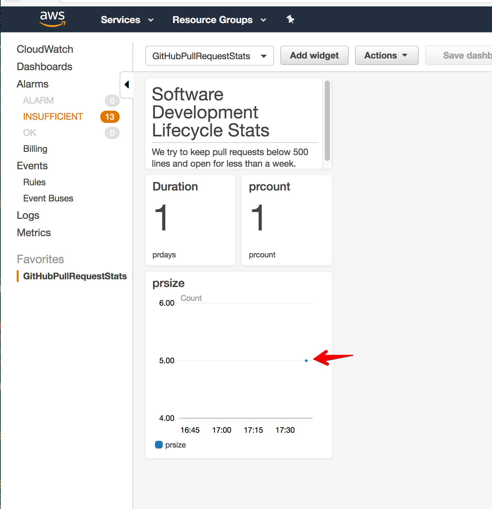

# prstats

This is an AWS serverless app that records PR stats into Cloudwatch Metrics.
The webhook will record metrics for as many repos as you want to configure
webhooks for, the repo name is recorded as a metric dimension. A metrics
dashboard is automatically defined for the first repo (specify the name as
a stack parameter).

## build

    ./buildlambda.sh

## test

AWS API keys are needed in order to push metrics to cloudwatch.

    aws-vault exec <myaccount> sam local start-api
    ngrok http 3000

Then go to Github and configure a webhook to send the PR event, and configure
the secret to match what you have set in template.yaml.

## deploy

    #  build the code (you need Go installed)
    ./buildlambda.sh
    # the name of the S3 bucket that you want the cloudformation template and
    # lambda zip artifact uploaded to
    export PRSTATS_BUCKET=<YOURBUCKETNAME>
    sam package --s3-bucket $PRSTATS_BUCKET --template-file template.yaml \
      --output-template-file serverless-output.yaml
    # follow the directions for deployment with aws cloudformation deploy
    # note that you need to include --capabilities CAPABILITY_IAM because the
    # template sets up a limited permissions policy for the lambda function
    cloudformation deploy -- --capabilities CAPABILITY_IAM --template-file \
      serverless-output.yaml --stack-name <yourstackname>

## Remaining issues

* Figure out the security token glitch with cli-driven deploy
* figure out how to support multiple dashboards
* extend test coverage
